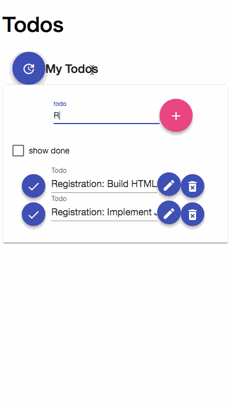

# AWS Serverless SPA(Single Page Application) Sample: Frontend

[](https://circleci.com/gh/nihemak/aws-sls-spa-sample-web)

This is a sample to frontend with Angular. The repositories for sample of backend are [API](https://github.com/nihemak/aws-sls-spa-sample-api) and  [Infrastructure](https://github.com/nihemak/aws-sls-spa-sample-terraform).



## Getting Started with Docker

Clone the Repository:

```bash
$ git clone https://github.com/nihemak/aws-sls-spa-sample-web.git sample-spa-web
$ cd sample-spa-web
```

Build docker environment:

```bash
$ npm run docker-build
```

### Connect to in-memory-web-api

Invoke `ng serve` in docker environment:

```bash
$ npm run docker-up-dev
$ npm run docker-serve
```

Access to frontend:

http://localhost:4200/

To stop the docker, execute the following:

```bash
$ npm run docker-down
```

### Connect to [aws-sls-spa-sample-api](https://github.com/nihemak/aws-sls-spa-sample-api)

Start [aws-sls-spa-sample-api](https://github.com/nihemak/aws-sls-spa-sample-api) of Docker: 

See: [aws-sls-spa-sample-api](https://github.com/nihemak/aws-sls-spa-sample-api).

Change `API_BASE_URL` of environment variable in docker to [aws-sls-spa-sample-api](https://github.com/nihemak/aws-sls-spa-sample-api)'s URL('http://localhost:3000'):

```bash
$ git diff dockers/docker-compose.yml
   angular:
     build: ./angular
     tty: true
     ports:
       - 4200:4200
     environment:
-      API_BASE_URL: 'mock-server'
+      API_BASE_URL: 'http://localhost:3000'
     volumes:
       - ../:/src/
```

Invoke `ng serve` in docker environment:

```bash
$ npm run docker-up-dev
$ npm run docker-serve
```

Access to frontend:

http://localhost:4200/

To stop the docker, execute the following:

```bash
$ npm run docker-down
```

## Getting Started with AWS

See: [aws-sls-spa-sample-terraform](https://github.com/nihemak/aws-sls-spa-sample-terraform).
